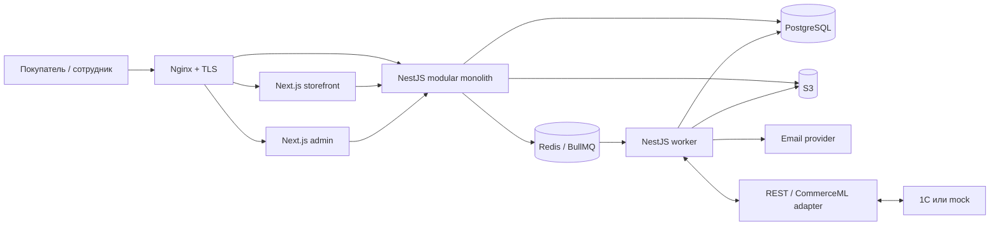

# Архитектура Pro Dessert

## Статус и инварианты

Документ фиксирует обязательную архитектуру MVP. Связанные документы: [ER-модель](./er-model.md), [владение данными](./data-ownership.md), [интеграция с 1С](./one-c-integration.md).

1. Pro Dessert — магазин товаров для кондитеров.
2. Единственный способ получения — `PICKUP` в магазине: Оренбург, Липовая улица, 20.
3. Единственный способ оплаты — `BANK_TRANSFER` на расчётный счёт бизнеса.
4. Реквизиты выдаются только после подтверждения наличия и резерва. Загруженный чек сам по себе не означает оплату.
5. 1С — источник номенклатуры, артикулов, цен, остатков, резервов и фактов исполнения; сайт хранит локальную проекцию.
6. Заказ разрешён без регистрации.
7. В MVP нет доставки, адреса/стоимости доставки, Shipment/Courier, статусов доставки, карточного эквайринга и платёжного шлюза.
8. Архитектура — модульный монолит, не микросервисы.

## Компоненты

- `apps/storefront`: Next.js 16, App Router, SSR/SSG и Server Components для публичного магазина.
- `apps/admin`: Next.js 16, закрытая панель сотрудников.
- `apps/api`: NestJS, versioned REST `/api/v1`, OpenAPI.
- `apps/worker`: отдельный процесс того же NestJS-кодового основания для BullMQ, outbox, 1С, email и истечения резервов. Это не отдельный сервис и не владеет данными.
- `packages/ui`, `packages/contracts`, `packages/validation`, `packages/config`: UI и единые контракты без серверных зависимостей.

В development используется Docker Compose; staging и production разделены по БД, Redis, bucket и credentials. PostgreSQL, Redis, S3 admin API и worker не публикуются наружу.

## Стиль backend и границы модулей

Внутри модуля направление зависимостей: `transport → application/use cases → domain → ports → infrastructure adapters`. Контроллеры не содержат бизнес-правил. Модуль не читает таблицы другого модуля напрямую: только application API, порт или доменное событие.

| Модуль                  | Ответственность                                                         |
| ----------------------- | ----------------------------------------------------------------------- |
| `IdentityModule`        | users, Argon2id, verification/reset tokens, server sessions, roles, 2FA |
| `CustomerModule`        | профили, организации, привязка гостевых заказов                         |
| `CatalogModule`         | продукты, варианты, бренды, категории, атрибуты, web-контент            |
| `SearchModule`          | PostgreSQL FTS, `pg_trgm`, синонимы, подсказки                          |
| `PricingModule`         | проекция цен 1С, скидки, ценовые снимки                                 |
| `InventoryModule`       | проекция складских остатков и available-to-promise                      |
| `PromotionModule`       | акции и области применения в границах ownership                         |
| `CartModule`            | guest/user cart, merge, серверная перепроверка                          |
| `CheckoutModule`        | контакты, согласия, только `PICKUP`/`BANK_TRANSFER`                     |
| `OrderModule`           | заказ, снимки строк, state machine, timeline, повтор заказа             |
| `ReservationModule`     | подтверждённые резервы, TTL, продление и освобождение                   |
| `PaymentModule`         | реквизиты, счета, payment proof, ручная проверка                        |
| `FileModule`            | quarantine/scan, S3 metadata и signed URLs                              |
| `ContentModule`         | страницы, баннеры, SEO, web-изображения                                 |
| `NotificationModule`    | transactional email и журнал отправок                                   |
| `OneCIntegrationModule` | canonical DTO, REST/CommerceML/mock adapters, sync/reconcile            |
| `OutboxModule`          | атомарные события и at-least-once delivery                              |
| `AuditModule`           | неизменяемый журнал значимых действий                                   |
| `SettingsModule`        | типизированные настройки, но не секреты                                 |

Административные endpoints — фасад над use cases этих модулей, а не параллельная бизнес-логика.

## Хранилища

**PostgreSQL** — единственная транзакционная база сайта: аккаунты, корзины, заказы, снимки, проекции 1С, резервы, payment metadata, idempotency, outbox, sync и audit. Деньги — `numeric(14,2)`, количества — `numeric(14,3)`, время — `timestamptz` UTC. Поиск MVP — PostgreSQL FTS + `pg_trgm`. Миграции версионируются; production `db push` запрещён.

**Redis** — BullMQ, rate limit, краткий cache и best-effort locks. Это не источник истины для заказа, оплаты, резерва или сессии.

**S3** — изображения и документы. Bucket закрыт; в PostgreSQL хранятся metadata/object key. Приватный файл выдаётся короткоживущей signed URL после authorization. Payment proof проходит size limit, magic-bytes/MIME allowlist, quarantine и антивирусную проверку, если она доступна.

## Критические сценарии и транзакции

### Создание заказа

1. `POST /api/v1/orders` требует `Idempotency-Key`.
2. Сервер принимает только `PICKUP` и `BANK_TRANSFER`, валидирует контакты/согласия и сам пересчитывает цену, скидку, активность и остаток.
3. Одна транзакция создаёт `orders`, неизменяемые `order_items`, первую `order_status_history`, idempotency result, audit и `outbox_events(order.created)`.
4. После commit worker экспортирует заказ в 1С; до подтверждения заказ имеет `AWAITING_STOCK_CONFIRMATION`.

Создание заказа не создаёт скрытый резерв. Окончательное наличие и резерв подтверждает 1С либо менеджер через команду, согласованную с 1С.

### Подтверждение и резерв

Для реальной 1С действие менеджера сначала становится командой 1С; локальный факт применяется по ack/event. В транзакции блокируются заказ, строки inventory и активные резервы в порядке `variant_id, warehouse_id`; проверяются версия, доступность и сумма. Создаются ровно один активный резерв на строку/склад, history/audit, статус `AWAITING_PAYMENT` и outbox для реквизитов. Отмена/истечение атомарно освобождает резерв. BullMQ timer дополняется периодическим sweeper, поэтому пропущенная job не оставляет вечный резерв.

### Банковский перевод

- реквизиты доступны только при `AWAITING_PAYMENT` и действующем резерве;
- proof переводит заказ в `PAYMENT_VERIFICATION`, но не устанавливает `paidAt`;
- менеджер/1С подтверждает факт поступления и переводит в `PAID`;
- отклонение proof требует комментария; при действующем резерве заказ возвращается в `AWAITING_PAYMENT`.

### State machine

Основной путь: `DRAFT → CREATED → AWAITING_STOCK_CONFIRMATION → AWAITING_PAYMENT → PAYMENT_VERIFICATION → PAID → ASSEMBLING → READY_FOR_PICKUP → COMPLETED`.

Дополнительные состояния: `CANCELLED_BY_CUSTOMER`, `CANCELLED_BY_STORE`, `RESERVATION_EXPIRED`, `RETURN_REQUESTED`, `RETURNED`. Произвольный `PATCH status` запрещён. Каждый переход хранит old/new status, actor, source (`STOREFRONT|ADMIN|ONE_C|SYSTEM`), comment, correlation ID и metadata.

## Конкуренция, idempotency и outbox

- Одна бизнес-команда изменяет агрегат, history, audit, idempotency и outbox в одной DB-транзакции. Внешний HTTP/S3/email внутри неё запрещён.
- Inventory/reservation защищены row locks; заказ — optimistic lock `orders.version`.
- Область idempotency key: actor/integration client + route + key. Хранятся request hash, resource ID и безопасный response.
- Тот же key/payload возвращает исходный ответ; тот же key с другим payload даёт `409 IDEMPOTENCY_KEY_REUSED`.
- Outbox worker читает `FOR UPDATE SKIP LOCKED`; доставка at-least-once, consumer идемпотентен. После исчерпания exponential backoff запись попадает в наблюдаемую DLQ и не удаляется.

## API и безопасность

- REST `/api/v1`, OpenAPI; стабильная ошибка: `code`, безопасные `message/details`, `correlationId`. Stack trace, SQL и внутренние ID клиенту не возвращаются.
- Server-side session ID в `Secure; HttpOnly; SameSite=Lax` cookie; rotation после login/privilege change, logout-all.
- Argon2id, пароль ≥10 символов, common-password denylist, rate limit, защита от enumeration/credential stuffing.
- Одноразовые verification/reset tokens хранятся как hash и атомарно инвалидируются.
- CSRF, CORS allowlist, Helmet/CSP, строгая серверная валидация и authorization каждого действия.
- RBAC: `CUSTOMER`, `MANAGER`, `CONTENT_MANAGER`, `ADMIN`, `SYSTEM`; для `ADMIN` обязательна 2FA.
- Integration endpoints используют отдельные credentials: предпочтительно mTLS, иначе HMAC-SHA256 с timestamp, nonce и content digest; допустим IP allowlist.
- PII маскируется в логах и запрещена в аналитике. Секреты поступают только из secret manager/environment.

## Наблюдаемость и деградация

Все HTTP requests, jobs и события 1С несут `correlationId`; JSON logs и Sentry проходят PII scrubber. Метрики: API/1С latency и error rate, queue age/depth/DLQ, freshness catalog/price/inventory, unknown UUID, расхождения суммы/остатка, застрявшие заказы, истекающие резервы и email failures.

`/health/live` проверяет процесс; `/health/ready` — PostgreSQL и критическую конфигурацию. Недоступность 1С отмечает компонент degraded, но не выключает чтение последней проекции. Новый заказ сохраняется в outbox и retry, однако реквизиты до подтверждения не выдаются. Потеря Redis не теряет бизнес-события. Email failure не откатывает доменный факт. Backup PostgreSQL считается рабочим только после регулярного restore test.

## Этапность и решения

Реализация следует этапам мастер-плана: (1) фундамент, (2) каталог, (3) cart/checkout, (4) 1С/резерв, (5) bank transfer, (6) кабинет, (7) admin, (8) качество/deploy. Каждый этап оставляет мигрируемую работающую систему.

Зафиксировано:

- Prisma ORM; параметризованный SQL допустим для locking/FTS внутри Prisma transaction API;
- server-side sessions, не JWT в localStorage;
- единая БД и единый backend; worker — второй runtime того же монолита;
- реальная 1С подключается после discovery; до этого используется явно маркированный mock adapter;
- доставка и карточная оплата не моделируются даже как скрытые незавершённые модули.
