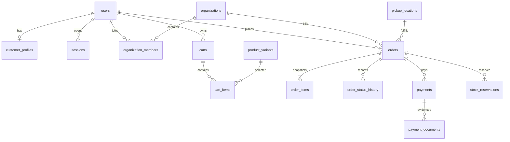
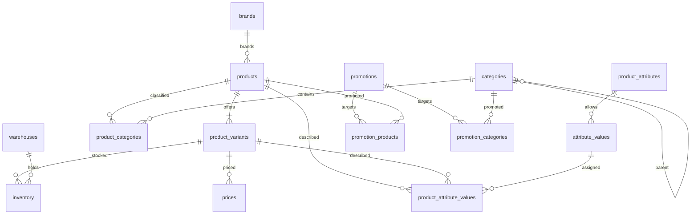

# ER-модель Pro Dessert

## Правила модели

- PostgreSQL, Prisma; таблицы/колонки в `snake_case`, TypeScript-модели в `PascalCase`/`camelCase`.
- PK — UUID v7/ULID-compatible UUID; внешний UUID 1С хранится отдельно и имеет `UNIQUE` в пределах источника.
- Все mutable-таблицы имеют `created_at`, `updated_at`; время — `timestamptz` UTC.
- Деньги — `numeric(14,2)` + `currency char(3)`; количество — `numeric(14,3)`, без `float`.
- PII удаляется/анонимизируется политикой retention; финансовые снимки и audit физически не каскадно удаляются.
- В MVP допустимы только `fulfillment_method=PICKUP` и `payment_method=BANK_TRANSFER`; колонок и таблиц доставки нет.

## Enum

```text
UserRole: CUSTOMER | MANAGER | CONTENT_MANAGER | ADMIN | SYSTEM
OrderStatus: DRAFT | CREATED | AWAITING_STOCK_CONFIRMATION | AWAITING_PAYMENT |
             PAYMENT_VERIFICATION | PAID | ASSEMBLING | READY_FOR_PICKUP |
             COMPLETED | CANCELLED_BY_CUSTOMER | CANCELLED_BY_STORE |
             RESERVATION_EXPIRED | RETURN_REQUESTED | RETURNED
StatusSource: STOREFRONT | ADMIN | ONE_C | SYSTEM
FulfillmentMethod: PICKUP
PaymentMethod: BANK_TRANSFER
PaymentStatus: PENDING | PROOF_UPLOADED | VERIFYING | CONFIRMED | REJECTED | REFUNDED
ReservationStatus: PENDING | ACTIVE | RELEASED | EXPIRED | CONSUMED
SyncDirection: INBOUND | OUTBOUND
SyncStatus: PENDING | PROCESSING | SUCCEEDED | RETRYING | FAILED | DEAD_LETTER
```

Enum ограничивается также `CHECK` в БД, чтобы некорректное значение нельзя было записать в обход приложения.

## Связи верхнего уровня





## Обязательные сущности

### Identity, клиенты и организации

| Таблица                     | Ключевые поля и связи                                                                                                | Ограничения/индексы                                                      |
| --------------------------- | -------------------------------------------------------------------------------------------------------------------- | ------------------------------------------------------------------------ |
| `users`                     | `email_normalized`, `password_hash`, `role`, `email_verified_at`, `totp_secret_encrypted`, `status`, `last_login_at` | `UNIQUE(email_normalized)`; password/TOTP никогда не логируются          |
| `email_verification_tokens` | `user_id → users`, `token_hash`, `expires_at`, `used_at`                                                             | `UNIQUE(token_hash)`; одноразовое consume в транзакции                   |
| `password_reset_tokens`     | `user_id → users`, `token_hash`, `expires_at`, `used_at`                                                             | то же; инвалидировать предыдущие активные tokens                         |
| `sessions`                  | `user_id → users`, `session_token_hash`, `expires_at`, `revoked_at`, `last_seen_at`, `ip_hash`, `user_agent`         | `UNIQUE(session_token_hash)`; индекс `(user_id, revoked_at, expires_at)` |
| `customer_profiles`         | `user_id → users`, `first_name`, `last_name`, `phone_e164`, notification preferences                                 | `UNIQUE(user_id)`; PII encrypted where supported                         |
| `organizations`             | `owner_user_id → users`, `legal_name`, `inn`, `kpp`, billing/contact data                                            | индекс `inn`; данные не считать проверенными без валидации               |
| `organization_members`      | `organization_id`, `user_id`, `member_role`                                                                          | `UNIQUE(organization_id,user_id)`                                        |
| `pickup_locations`          | `code`, `name`, `address_text`, coordinates, contacts, hours JSON, `active`                                          | `UNIQUE(code)`; MVP seed — одна точка на Липовой, 20                     |

### Каталог, цены и остатки

| Таблица                    | Ключевые поля и связи                                                                                                                       | Ограничения/индексы                                                         |
| -------------------------- | ------------------------------------------------------------------------------------------------------------------------------------------- | --------------------------------------------------------------------------- |
| `brands`                   | `one_c_id`, `name`, `slug`, `active`, SEO/content                                                                                           | `UNIQUE(one_c_id)`, `UNIQUE(slug)`                                          |
| `products`                 | `one_c_id`, `brand_id`, base `name`, `slug`, description/SEO, `active`, `is_hit`, `is_new`, search vector                                   | `UNIQUE(one_c_id)`, `UNIQUE(slug)`; GIN FTS + trigram name/SKU indexes      |
| `product_variants`         | `product_id`, `one_c_id`, `sku`, offer name, pack, unit, VAT, min qty, sales multiple, country/manufacturer, shelf/storage fields, `active` | `UNIQUE(one_c_id)`, `UNIQUE(sku)` when non-null; positive quantity checks   |
| `product_attributes`       | `code`, `name`, `data_type`, `filterable`, `category_scope`, sort                                                                           | `UNIQUE(code)`; types: text/number/bool/enum/range                          |
| `attribute_values`         | `attribute_id`, normalized/display value, numeric/bool value, unit, sort                                                                    | unique normalized value per attribute                                       |
| `product_attribute_values` | `product_id` xor `variant_id`, `attribute_id`, optional `value_id`, typed custom value, source                                              | exactly one owner and one typed value; indexes for filters                  |
| `categories`               | `parent_id → categories`, `one_c_group_id`, `name`, `slug`, `path`, sort, image, SEO, `active`, `hidden`                                    | `UNIQUE(slug)`, cycle prevention; normalized public tree may differ from 1С |
| `product_categories`       | `product_id`, `category_id`, `is_primary`, sort                                                                                             | `UNIQUE(product_id,category_id)`; at most one primary category/product      |
| `warehouses`               | `one_c_id`, `code`, `name`, `pickup_location_id`, `active`                                                                                  | `UNIQUE(one_c_id)`, `UNIQUE(code)`                                          |
| `inventory`                | `variant_id`, `warehouse_id`, `on_hand`, `reserved`, `available`, `source_version`, `as_of`                                                 | `UNIQUE(variant_id,warehouse_id)`; non-negative checks; row lock on reserve |
| `prices`                   | `variant_id`, `price_type`, `amount`, `old_amount`, `currency`, VAT inclusion, `valid_from/to`, `source_version`                            | no overlapping active interval per variant/type; amount ≥ 0                 |
| `promotions`               | title/content, `starts_at`, `ends_at`, priority, `active`, discount definition, ownership/source                                            | end > start; site discount only when agreed with 1С                         |
| `promotion_products`       | `promotion_id`, `product_id`                                                                                                                | composite PK/unique                                                         |
| `promotion_categories`     | `promotion_id`, `category_id`                                                                                                               | composite PK/unique                                                         |

Изображения не хранятся binary в PostgreSQL. Поддерживающая `product_images` связывает product/variant с `media_assets`, хранит source, alt, sort, publication status и optional 1С asset ID. 1С-изображение — исходный материал; публикацией, alt и порядком управляет сайт.

### Корзина и заказ

| Таблица                | Ключевые поля и связи                                                                               | Ограничения/индексы                                                          |
| ---------------------- | --------------------------------------------------------------------------------------------------- | ---------------------------------------------------------------------------- |
| `carts`                | nullable `user_id`, `guest_token_hash`, status, currency, `expires_at`, `version`                   | ровно один owner; один активный cart на user/guest                           |
| `cart_items`           | `cart_id`, `variant_id`, quantity, observed price/version                                           | `UNIQUE(cart_id,variant_id)`; quantity > 0; данные всегда перепроверяются    |
| `orders`               | см. отдельный перечень ниже                                                                         | unique public number/idempotency; optimistic `version`                       |
| `order_items`          | снимок товара/цены, `order_id`, nullable current `product_id/variant_id`                            | immutable после создания, кроме согласованной корректировки с новой ревизией |
| `order_status_history` | `order_id`, old/new status, actor user/system, source, comment, correlation ID, metadata, timestamp | append-only; индекс `(order_id,created_at)`                                  |

Обязательные поля `orders`:

```text
id, public_number, customer_id?, guest_email, guest_phone, guest_name,
organization_id?, pickup_location_id, fulfillment_method=PICKUP,
payment_method=BANK_TRANSFER, subtotal, discount_total, grand_total, currency,
status, customer_comment?, internal_comment?, reservation_expires_at?,
one_c_id?, idempotency_key, version, created_at, updated_at,
paid_at?, ready_for_pickup_at?, completed_at?, cancelled_at?
```

`public_number` и `(idempotency_scope,idempotency_key)` уникальны. Должен быть либо `customer_id`, либо валидный guest contact snapshot. `grand_total = subtotal - discount_total`; shipping amount отсутствует.

Снимок `order_items` обязательно содержит: `product_id?`, `variant_id?`, `one_c_id`, SKU, название, бренд, фасовку, единицу, unit price, old price, discount, VAT, quantity, line total и image key на момент заказа. Старый заказ не восстанавливается из текущей карточки товара.

### Оплата и резерв

| Таблица              | Ключевые поля и связи                                                                                                                | Ограничения/индексы                                                       |
| -------------------- | ------------------------------------------------------------------------------------------------------------------------------------ | ------------------------------------------------------------------------- |
| `payments`           | `order_id`, method, status, amount, currency, payer reference, confirmed source/by/at, rejection comment, `one_c_id`                 | method=`BANK_TRANSFER`; одна активная попытка на заказ; proof ≠ confirmed |
| `payment_documents`  | `payment_id`, uploader, S3 key, original name, MIME, size, hash, scan status, created_at                                             | `UNIQUE(content_hash,payment_id)`; private/quarantine by default          |
| `stock_reservations` | `order_id`, `order_item_id`, `variant_id`, `warehouse_id`, quantity, status, external ID, `expires_at`, released/consumed timestamps | unique active reservation per order item/warehouse; quantity > 0          |

Доступное количество считается из подтверждённой проекции 1С. Создание/продление/освобождение резерва блокирует соответствующие inventory/reservation rows. Повторное событие с тем же external reservation ID не создаёт второй резерв.

### Интеграция, аудит, контент и уведомления

| Таблица                      | Ключевые поля и связи                                                                                                                              | Ограничения/индексы                                                          |
| ---------------------------- | -------------------------------------------------------------------------------------------------------------------------------------------------- | ---------------------------------------------------------------------------- |
| `sync_jobs`                  | direction, type, adapter, external event ID, idempotency key, status, attempts, next attempt, correlation ID, payload hash/ref, counts, timestamps | unique `(adapter,direction,external_event_id)`; payload PII masked/encrypted |
| `sync_errors`                | `sync_job_id`, safe code/message, entity type/external ID, retryable, details, occurred/resolved fields                                            | индекс unresolved/severity; stack только в restricted telemetry              |
| `audit_logs`                 | actor ID/role, source, action, entity type/ID, before/after safe JSON, reason, correlation ID, IP hash, timestamp                                  | append-only; запрет UPDATE/DELETE для app role                               |
| `banners`                    | title/text/image/link, starts/ends, priority, colors, active                                                                                       | автоматическая неактивность за пределами окна                                |
| `pages`                      | type, slug, title, body, SEO, publication/legal-review status, revision                                                                            | `UNIQUE(slug)`; legal pages помечены review-required                         |
| `search_synonyms`            | normalized term, canonical term, locale, weight, active                                                                                            | unique normalized pair; trigram indexes                                      |
| `notification_subscriptions` | `user_id` or guest/order scope, channel, event, enabled, verified destination                                                                      | unique scope/channel/event                                                   |
| `email_logs`                 | template, recipient masked/hash, order/user refs, provider ID, status, attempts, sent/error timestamps, correlation ID                             | не хранить body с PII без необходимости                                      |
| `settings`                   | key, typed value JSON, scope/environment, version, updated by                                                                                      | `UNIQUE(scope,key)`; секреты запрещены                                       |

## Поддерживающие технические сущности

Они необходимы для production-инвариантов и дополняют перечень мастер-промпта:

| Таблица               | Назначение                                                                                                        |
| --------------------- | ----------------------------------------------------------------------------------------------------------------- |
| `idempotency_records` | scope/key, request hash, state, resource/response, expiry; unique `(scope,key)`                                   |
| `outbox_events`       | aggregate, type, payload/version, correlation/causation IDs, attempts, available/published/dead-letter timestamps |
| `media_assets`        | S3 object key, MIME, size/hash, owner/source, scan/publication status                                             |
| `product_images`      | связь media с product/variant, alt, sort, source и 1С asset ID                                                    |

## Обязательные ограничения и индексы

1. Partial unique index запрещает более одной активной session token, cart owner collision, active reservation и выполняющийся idempotency key.
2. `orders.version` увеличивается каждым переходом; команда с устаревшей ожидаемой версией получает `409 ORDER_VERSION_CONFLICT`.
3. Триггеры/DB grants запрещают изменение `order_status_history` и `audit_logs` application role после insert.
4. Foreign keys для финансовых/аудитных данных используют `RESTRICT`/`SET NULL`, не `CASCADE`.
5. Индексы: order public number; order `(status,created_at)`; reservation `(status,expires_at)`; payment status; sync unresolved/status/next_attempt; inventory `(variant_id,warehouse_id)`; active prices; product/category joins; FTS GIN и `pg_trgm` GIN/GiST.
6. Импорт 1С применяет `source_version`/`as_of`: устаревшее событие не перезаписывает более новое.
7. Невалидные cross-field условия (например, `PAID` без подтверждённого payment) проверяются доменной политикой и integration tests; важные простые условия дублируются DB `CHECK`.
